# Entity-Relationship Diagrams

## Full ecosystem

```mermaid
erDiagram
    SITES ||--o{ DIVISIONS : "center_site_id"
    DIVISIONS ||--o{ DEPARTMENTS : "division_id"
    SITES ||--o{ DEPARTMENTS : "primary_site_id"
    DEPARTMENTS ||--o{ ROLES : "department_id"
    SITES ||--o{ EMPLOYEES : "site_id"
    DIVISIONS ||--o{ EMPLOYEES : "division_id"
    DEPARTMENTS ||--o{ EMPLOYEES : "department_id"
    TEAMS ||--o{ EMPLOYEES : "team_id"
    ROLES ||--o{ EMPLOYEES : "role_id"
    EMPLOYEES ||--o{ EMPLOYEES : "manager_id"
    DEPARTMENTS ||--o{ TEAMS : "department_id"
    DIVISIONS ||--o{ TEAMS : "division_id"
    SITES ||--o{ TEAMS : "site_id"
    EMPLOYEES ||--o{ TEAMS : "team_lead_employee_id"
    SKILL_TAXONOMY ||--o{ SKILL_TAXONOMY : "parent_taxonomy_id"
    SKILL_TAXONOMY ||--o{ SKILLS : "cluster_id"
    SKILL_TAXONOMY ||--o{ SKILLS : "domain_id"
    EMPLOYEES ||--o{ EMPLOYEE_SKILLS : "employee_id"
    SKILLS ||--o{ EMPLOYEE_SKILLS : "skill_id"
    SKILLS ||--o{ LEARNING_CONTENT : "skill_id"
    DEPARTMENTS ||--o{ LEARNING_PATHS : "owner_department_id"
    LEARNING_PATHS ||--o{ LEARNING_PATH_ITEMS : "path_id"
    LEARNING_CONTENT ||--o{ LEARNING_PATH_ITEMS : "content_id"
    EMPLOYEES ||--o{ LEARNING_RECORDS : "employee_id"
    LEARNING_CONTENT ||--o{ LEARNING_RECORDS : "content_id"
    LEARNING_PATHS ||--o{ LEARNING_RECORDS : "path_id"
    EMPLOYEES ||--o{ AI_CAPABILITY_LEVELS : "employee_id"
    LEARNING_PATHS ||--o{ AI_CAPABILITY_LEVELS : "recommended_path_id"
    ROLES ||--o{ CAREER_PATHS : "from_role_id"
    ROLES ||--o{ CAREER_PATHS : "to_role_id"
    EMPLOYEES ||--o{ INTERNAL_MOBILITY : "employee_id"
    ROLES ||--o{ INTERNAL_MOBILITY : "from_role_id"
    ROLES ||--o{ INTERNAL_MOBILITY : "to_role_id"
    TEAMS ||--o{ INTERNAL_MOBILITY : "from_team_id"
    TEAMS ||--o{ INTERNAL_MOBILITY : "to_team_id"
    ROLES ||--o{ JOB_REQUISITIONS : "role_id"
    DEPARTMENTS ||--o{ JOB_REQUISITIONS : "department_id"
    TEAMS ||--o{ JOB_REQUISITIONS : "team_id"
    SITES ||--o{ JOB_REQUISITIONS : "site_id"
    EMPLOYEES ||--o{ JOB_REQUISITIONS : "hiring_manager_id"
    JOB_REQUISITIONS ||--o{ REQUISITION_SKILLS : "requisition_id"
    SKILLS ||--o{ REQUISITION_SKILLS : "skill_id"
    DIVISIONS ||--o{ PROCESS_DEFINITIONS : "division_id"
    DEPARTMENTS ||--o{ PROCESS_DEFINITIONS : "owner_department_id"
    PROCESS_DEFINITIONS ||--o{ PROCESS_ACTIVITIES : "process_id"
    DIVISIONS ||--o{ APPLICATIONS : "division_id"
    TEAMS ||--o{ APPLICATIONS : "owner_team_id"
    TEAMS ||--o{ AI_MODELS : "owner_team_id"
    AI_MODELS ||--o{ MODEL_VERSIONS : "model_id"
    DIVISIONS ||--o{ AI_USE_CASES : "division_id"
    PROCESS_DEFINITIONS ||--o{ AI_USE_CASES : "process_id"
    TEAMS ||--o{ AI_USE_CASES : "owner_team_id"
    EMPLOYEES ||--o{ AI_USE_CASES : "sponsor_employee_id"
    EMPLOYEES ||--o{ AI_USE_CASES : "product_owner_employee_id"
    AI_MODELS ||--o{ AI_USE_CASES : "model_id"
    AI_USE_CASES ||--o{ AI_USE_CASE_KPIS : "use_case_id"
    AI_USE_CASES ||--o{ AI_GOVERNANCE_REVIEWS : "use_case_id"
    EMPLOYEES ||--o{ AI_GOVERNANCE_REVIEWS : "reviewer_employee_id"
    AI_USE_CASES ||--o{ PROJECTS : "use_case_id"
    TEAMS ||--o{ PROJECTS : "owner_team_id"
    DIVISIONS ||--o{ PROJECTS : "division_id"
    EMPLOYEES ||--o{ PROJECTS : "pm_employee_id"
    PROJECTS ||--o{ PROJECT_MEMBERS : "project_id"
    EMPLOYEES ||--o{ PROJECT_MEMBERS : "employee_id"
    PROJECTS ||--o{ PROJECT_TASKS : "project_id"
    EMPLOYEES ||--o{ PROJECT_TASKS : "assignee_employee_id"
    PROJECTS ||--o{ MILESTONES : "project_id"
    PROJECTS ||--o{ PROJECT_RISKS : "project_id"
    EMPLOYEES ||--o{ PROJECT_RISKS : "owner_employee_id"
    EMPLOYEES ||--o{ INNOVATION_IDEAS : "submitted_by_employee_id"
    TEAMS ||--o{ INNOVATION_IDEAS : "team_id"
    AI_USE_CASES ||--o{ INNOVATION_IDEAS : "linked_use_case_id"
    INSTITUTIONS ||--o{ AUTHORS : "primary_institution_id"
    AUTHORS ||--o{ AUTHOR_AFFILIATIONS : "author_id"
    INSTITUTIONS ||--o{ AUTHOR_AFFILIATIONS : "institution_id"
    TEAMS ||--o{ JOURNALS : "managing_team_id"
    AUTHORS ||--o{ JOURNALS : "editor_in_chief_author_id"
    JOURNALS ||--o{ MANUSCRIPTS : "journal_id"
    AUTHORS ||--o{ MANUSCRIPTS : "corresponding_author_id"
    AUTHORS ||--o{ MANUSCRIPTS : "handling_editor_author_id"
    EMPLOYEES ||--o{ MANUSCRIPTS : "ops_coordinator_employee_id"
    MANUSCRIPTS ||--o{ PEER_REVIEW_ASSIGNMENTS : "manuscript_id"
    AUTHORS ||--o{ PEER_REVIEW_ASSIGNMENTS : "reviewer_author_id"
    MANUSCRIPTS ||--o{ RESEARCH_PAPERS_PUBLISHED : "manuscript_id"
    JOURNALS ||--o{ RESEARCH_PAPERS_PUBLISHED : "journal_id"
    INSTITUTIONS ||--o{ RESEARCH_PAPERS_PUBLISHED : "institution_id"
    RESEARCH_PAPERS_PUBLISHED ||--o{ PAPER_AUTHORS : "paper_id"
    AUTHORS ||--o{ PAPER_AUTHORS : "author_id"
    INSTITUTIONS ||--o{ PAPER_AUTHORS : "affiliation_institution_id"
    RESEARCH_PAPERS_PUBLISHED ||--o{ CITATIONS : "citing_paper_id"
    RESEARCH_PAPERS_PUBLISHED ||--o{ CITATIONS : "cited_paper_id"
    RESEARCH_PAPERS_PUBLISHED ||--o{ CONTENT_PRODUCTION_JOBS : "paper_id"
    TEAMS ||--o{ CONTENT_PRODUCTION_JOBS : "team_id"
    EMPLOYEES ||--o{ CONTENT_PRODUCTION_JOBS : "assignee_employee_id"
    CONTENT_PRODUCTION_JOBS ||--o{ XML_CONVERSION_DEFECTS : "job_id"
    RESEARCH_PAPERS_PUBLISHED ||--o{ XML_CONVERSION_DEFECTS : "paper_id"
    RESEARCH_PAPERS_PUBLISHED ||--o{ RESEARCH_INTEGRITY_FLAGS : "paper_id"
    MANUSCRIPTS ||--o{ RESEARCH_INTEGRITY_FLAGS : "manuscript_id"
    EMPLOYEES ||--o{ RESEARCH_INTEGRITY_FLAGS : "assigned_employee_id"
    JURISDICTIONS ||--o{ COURTS : "jurisdiction_id"
    JURISDICTIONS ||--o{ LEGAL_DOCUMENTS : "jurisdiction_id"
    COURTS ||--o{ LEGAL_DOCUMENTS : "court_id"
    PRACTICE_AREAS ||--o{ LEGAL_DOCUMENTS : "practice_area_id"
    LEGAL_DOCUMENTS ||--o{ LEGAL_CITATIONS : "citing_doc_id"
    LEGAL_DOCUMENTS ||--o{ LEGAL_CITATIONS : "cited_doc_id"
    LEGAL_DOCUMENTS ||--o{ EDITORIAL_TASKS : "doc_id"
    TEAMS ||--o{ EDITORIAL_TASKS : "team_id"
    EMPLOYEES ||--o{ EDITORIAL_TASKS : "editor_employee_id"
    AI_MODELS ||--o{ EDITORIAL_TASKS : "model_id"
    JURISDICTIONS ||--o{ REGULATORY_UPDATES : "jurisdiction_id"
    PRACTICE_AREAS ||--o{ REGULATORY_UPDATES : "practice_area_id"
    REGULATORY_UPDATES ||--o{ REGULATORY_UPDATE_IMPACTS : "update_id"
    LEGAL_DOCUMENTS ||--o{ REGULATORY_UPDATE_IMPACTS : "doc_id"
    EMPLOYEES ||--o{ REGULATORY_UPDATE_IMPACTS : "editor_employee_id"
    BUSINESS_ENTITIES ||--o{ OWNERSHIP_LINKS : "parent_entity_id"
    BUSINESS_ENTITIES ||--o{ OWNERSHIP_LINKS : "child_entity_id"
    DIVISIONS ||--o{ PRODUCTS : "division_id"
    INDIVIDUALS ||--o{ ADDRESSES : "individual_id"
    INDIVIDUALS ||--o{ IDENTITY_ATTRIBUTES : "individual_id"
    INDIVIDUALS ||--o{ DEVICES : "individual_id"
    INDIVIDUALS ||--o{ ACCOUNTS : "individual_id"
    BUSINESS_ENTITIES ||--o{ ACCOUNTS : "entity_id"
    CUSTOMERS ||--o{ ACCOUNTS : "client_customer_id"
    ACCOUNTS ||--o{ TRANSACTIONS : "account_id"
    ACCOUNTS ||--o{ TRANSACTIONS : "counterparty_account_id"
    DEVICES ||--o{ TRANSACTIONS : "device_id"
    INDIVIDUALS ||--o{ WATCHLISTS : "individual_id"
    BUSINESS_ENTITIES ||--o{ WATCHLISTS : "entity_id"
    AI_MODELS ||--o{ ALERT_RULES : "model_id"
    TEAMS ||--o{ ALERT_RULES : "owner_team_id"
    ALERT_RULES ||--o{ RISK_ALERTS : "rule_id"
    TRANSACTIONS ||--o{ RISK_ALERTS : "txn_id"
    ACCOUNTS ||--o{ RISK_ALERTS : "account_id"
    EMPLOYEES ||--o{ RISK_ALERTS : "analyst_employee_id"
    CUSTOMERS ||--o{ KYC_CASES : "client_customer_id"
    INDIVIDUALS ||--o{ KYC_CASES : "subject_individual_id"
    BUSINESS_ENTITIES ||--o{ KYC_CASES : "subject_entity_id"
    EMPLOYEES ||--o{ KYC_CASES : "analyst_employee_id"
    RISK_ALERTS ||--o{ INVESTIGATIONS : "alert_id"
    KYC_CASES ||--o{ INVESTIGATIONS : "kyc_case_id"
    EMPLOYEES ||--o{ INVESTIGATIONS : "lead_analyst_employee_id"
    INVESTIGATIONS ||--o{ ANALYST_ACTIONS : "investigation_id"
    EMPLOYEES ||--o{ ANALYST_ACTIONS : "analyst_employee_id"
    DIVISIONS ||--o{ KNOWLEDGE_ARTICLES : "division_id"
    PRODUCTS ||--o{ KNOWLEDGE_ARTICLES : "product_id"
    APPLICATIONS ||--o{ KNOWLEDGE_ARTICLES : "app_id"
    TEAMS ||--o{ KNOWLEDGE_ARTICLES : "owner_team_id"
    EMPLOYEES ||--o{ KNOWLEDGE_ARTICLES : "author_employee_id"
    KNOWLEDGE_ARTICLES ||--o{ KNOWLEDGE_ARTICLE_VERSIONS : "article_id"
    EMPLOYEES ||--o{ KNOWLEDGE_ARTICLE_VERSIONS : "edited_by_employee_id"
    KNOWLEDGE_ARTICLES ||--o{ SOPS : "article_id"
    PROCESS_DEFINITIONS ||--o{ SOPS : "process_id"
    EMPLOYEES ||--o{ SOPS : "owner_employee_id"
    CUSTOMERS ||--o{ SUBSCRIPTIONS : "customer_id"
    PRODUCTS ||--o{ SUBSCRIPTIONS : "product_id"
    INSTITUTIONS ||--o{ CUSTOMERS : "institution_id"
    BUSINESS_ENTITIES ||--o{ CUSTOMERS : "entity_id"
    DIVISIONS ||--o{ CUSTOMERS : "primary_division_id"
    EMPLOYEES ||--o{ CUSTOMERS : "account_owner_employee_id"
    CUSTOMERS ||--o{ CHURN_EVENTS : "customer_id"
    SUBSCRIPTIONS ||--o{ CHURN_EVENTS : "primary_subscription_id"
    SUBSCRIPTIONS ||--o{ PRODUCT_USAGE_MONTHLY : "subscription_id"
    CUSTOMERS ||--o{ PRODUCT_USAGE_MONTHLY : "customer_id"
    PRODUCTS ||--o{ PRODUCT_USAGE_MONTHLY : "product_id"
    CUSTOMERS ||--o{ SUPPORT_CASES : "customer_id"
    PRODUCTS ||--o{ SUPPORT_CASES : "product_id"
    DIVISIONS ||--o{ SUPPORT_CASES : "division_id"
    TEAMS ||--o{ SUPPORT_CASES : "team_id"
    EMPLOYEES ||--o{ SUPPORT_CASES : "agent_employee_id"
    KNOWLEDGE_ARTICLES ||--o{ SUPPORT_CASES : "kb_article_id"
    SUPPORT_CASES ||--o{ CASE_INTERACTIONS : "case_id"
    EMPLOYEES ||--o{ CASE_INTERACTIONS : "employee_id"
    CUSTOMERS ||--o{ FEATURE_REQUESTS : "customer_id"
    PRODUCTS ||--o{ FEATURE_REQUESTS : "product_id"
    SUPPORT_CASES ||--o{ FEATURE_REQUESTS : "case_id"
    PROJECTS ||--o{ FEATURE_REQUESTS : "linked_project_id"
    SUBSCRIPTIONS ||--o{ RENEWAL_OPPORTUNITIES : "subscription_id"
    CUSTOMERS ||--o{ RENEWAL_OPPORTUNITIES : "customer_id"
    EMPLOYEES ||--o{ RENEWAL_OPPORTUNITIES : "owner_employee_id"
    TEAMS ||--o{ EVENTS : "organizer_team_id"
    EVENTS ||--o{ EVENT_SESSIONS : "event_id"
    EVENTS ||--o{ EXHIBITORS : "event_id"
    BUSINESS_ENTITIES ||--o{ EXHIBITORS : "entity_id"
    EMPLOYEES ||--o{ EXHIBITORS : "account_manager_employee_id"
    BUSINESS_ENTITIES ||--o{ VISITORS : "company_entity_id"
    VISITORS ||--o{ REGISTRATIONS : "visitor_id"
    EVENTS ||--o{ REGISTRATIONS : "event_id"
    REGISTRATIONS ||--o{ BADGE_SCANS : "registration_id"
    EXHIBITORS ||--o{ BADGE_SCANS : "exhibitor_id"
    EXHIBITORS ||--o{ LEADS : "exhibitor_id"
    VISITORS ||--o{ LEADS : "visitor_id"
    EVENTS ||--o{ LEADS : "event_id"
    BADGE_SCANS ||--o{ LEADS : "scan_id"
    CUSTOMERS ||--o{ LEADS : "converted_customer_id"
    REGISTRATIONS ||--o{ SESSION_ATTENDANCE : "registration_id"
    EVENT_SESSIONS ||--o{ SESSION_ATTENDANCE : "session_id"
    REGISTRATIONS ||--o{ EVENT_FEEDBACK : "registration_id"
    EVENTS ||--o{ EVENT_FEEDBACK : "event_id"
    DEPARTMENTS ||--o{ COST_CENTERS : "department_id"
    DIVISIONS ||--o{ COST_CENTERS : "division_id"
    SITES ||--o{ COST_CENTERS : "site_id"
    BUSINESS_ENTITIES ||--o{ SUPPLIERS : "entity_id"
    SUPPLIERS ||--o{ SUPPLIER_ENROLLMENT_REQUESTS : "supplier_id"
    EMPLOYEES ||--o{ SUPPLIER_ENROLLMENT_REQUESTS : "requested_by_employee_id"
    SUPPLIERS ||--o{ PURCHASE_ORDERS : "supplier_id"
    COST_CENTERS ||--o{ PURCHASE_ORDERS : "cost_center_id"
    EMPLOYEES ||--o{ PURCHASE_ORDERS : "requester_employee_id"
    EMPLOYEES ||--o{ PURCHASE_ORDERS : "approver_employee_id"
    SUPPLIERS ||--o{ INVOICES : "supplier_id"
    PURCHASE_ORDERS ||--o{ INVOICES : "po_id"
    EMPLOYEES ||--o{ INVOICES : "processor_employee_id"
    INVOICES ||--o{ INVOICE_LINES : "invoice_id"
    COST_CENTERS ||--o{ INVOICE_LINES : "cost_center_id"
    INVOICES ||--o{ INVOICE_EXCEPTIONS : "invoice_id"
    EMPLOYEES ||--o{ INVOICE_EXCEPTIONS : "resolver_employee_id"
    INVOICES ||--o{ PAYMENTS : "invoice_id"
    COST_CENTERS ||--o{ OPEX_BUDGET_VS_ACTUAL : "cost_center_id"
    DIVISIONS ||--o{ OPEX_BUDGET_VS_ACTUAL : "division_id"
    APPLICATIONS ||--o{ CHANGES : "app_id"
    EMPLOYEES ||--o{ CHANGES : "requested_by_employee_id"
    APPLICATIONS ||--o{ PROBLEMS : "app_id"
    APPLICATIONS ||--o{ IT_TICKETS : "app_id"
    EMPLOYEES ||--o{ IT_TICKETS : "requester_employee_id"
    TEAMS ||--o{ IT_TICKETS : "assignment_group_team_id"
    EMPLOYEES ||--o{ IT_TICKETS : "assignee_employee_id"
    KNOWLEDGE_ARTICLES ||--o{ IT_TICKETS : "kb_article_id"
    IT_TICKETS ||--o{ INCIDENTS : "ticket_id"
    APPLICATIONS ||--o{ INCIDENTS : "app_id"
    CHANGES ||--o{ INCIDENTS : "caused_by_change_id"
    PROBLEMS ||--o{ INCIDENTS : "problem_id"
    EMPLOYEES ||--o{ ACCESS_REQUESTS : "requester_employee_id"
    APPLICATIONS ||--o{ ACCESS_REQUESTS : "app_id"
    ACCESS_REQUESTS ||--o{ ACCESS_REQUEST_APPROVALS : "access_request_id"
    EMPLOYEES ||--o{ ACCESS_REQUEST_APPROVALS : "approver_employee_id"
    APPLICATIONS ||--o{ SYSTEM_EVENTS : "app_id"
    EMPLOYEES ||--o{ SYSTEM_EVENTS : "user_employee_id"
    PROCESS_DEFINITIONS ||--o{ PROCESS_EVENT_LOG : "process_id"
    PROCESS_ACTIVITIES ||--o{ PROCESS_EVENT_LOG : "activity_id"
    EMPLOYEES ||--o{ PROCESS_EVENT_LOG : "resource_employee_id"
    APPLICATIONS ||--o{ PROCESS_EVENT_LOG : "system_app_id"
    PROCESS_DEFINITIONS ||--o{ AUTOMATION_CANDIDATES : "process_id"
    PROCESS_ACTIVITIES ||--o{ AUTOMATION_CANDIDATES : "activity_id"
    EMPLOYEES ||--o{ AI_USAGE_EVENTS : "employee_id"
    AI_USE_CASES ||--o{ AI_USAGE_EVENTS : "use_case_id"
    AI_MODELS ||--o{ AI_USAGE_EVENTS : "model_id"
    EMPLOYEES ||--o{ PROMPTS_LIBRARY : "author_employee_id"
    AI_USE_CASES ||--o{ PROMPTS_LIBRARY : "use_case_id"
    AI_USAGE_EVENTS ||--o{ AI_FEEDBACK : "usage_event_id"
    EMPLOYEES ||--o{ AI_FEEDBACK : "employee_id"
    PROJECTS ||--o{ DOCUMENTS : "project_id"
    EMPLOYEES ||--o{ DOCUMENTS : "author_employee_id"
    PROJECTS ||--o{ MEETINGS : "project_id"
    TEAMS ||--o{ MEETINGS : "team_id"
    EMPLOYEES ||--o{ MEETINGS : "organizer_employee_id"
    MEETINGS ||--o{ ACTION_ITEMS : "meeting_id"
    EMPLOYEES ||--o{ ACTION_ITEMS : "owner_employee_id"
    TEAMS ||--o{ CHAT_CHANNELS : "team_id"
    PROJECTS ||--o{ CHAT_CHANNELS : "project_id"
    CHAT_CHANNELS ||--o{ CHAT_MESSAGES : "channel_id"
    EMPLOYEES ||--o{ CHAT_MESSAGES : "sender_employee_id"
    CHAT_MESSAGES ||--o{ CHAT_MESSAGES : "reply_to_message_id"
    EMPLOYEES ||--o{ EMAILS : "sender_employee_id"
    EMPLOYEES ||--o{ EMAILS : "recipient_employee_id"
    SUPPORT_CASES ||--o{ EMAILS : "related_case_id"
    EMPLOYEES ||--o{ SEARCH_LOGS : "employee_id"
    KNOWLEDGE_ARTICLES ||--o{ SEARCH_LOGS : "clicked_article_id"
    TEAMS ||--o{ PERFORMANCE_METRICS_AGGREGATE : "team_id"
```

## A. Organization & Workforce

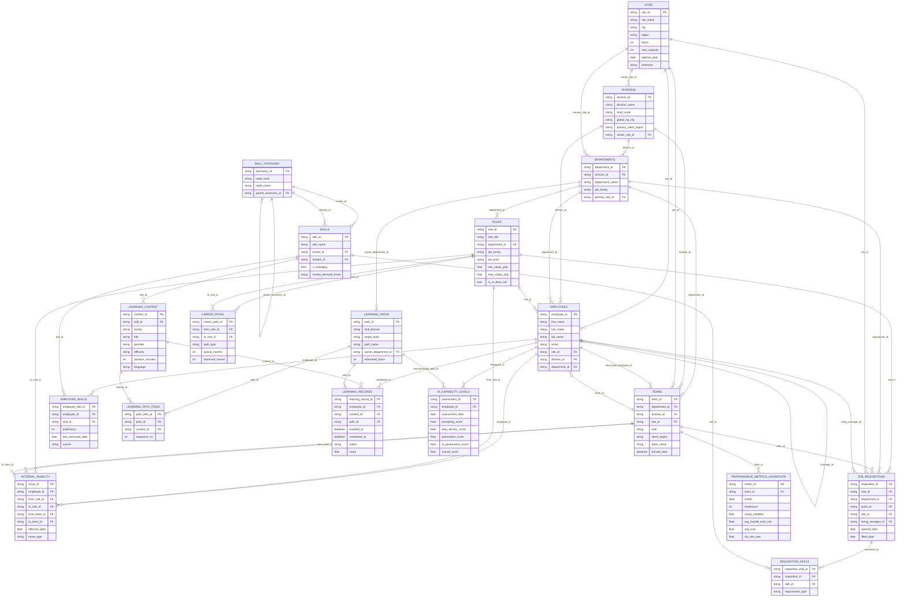

## B. Scholarly & Health Publishing Operations

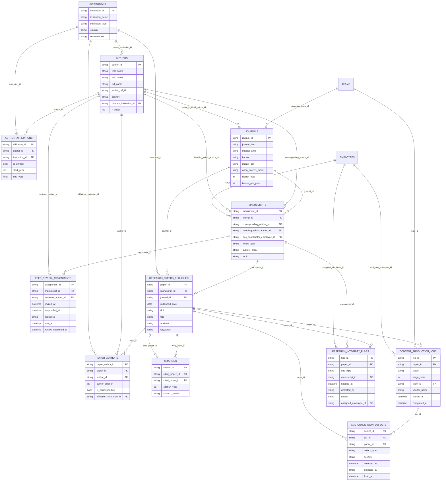

## C. Legal & Professional Content Operations

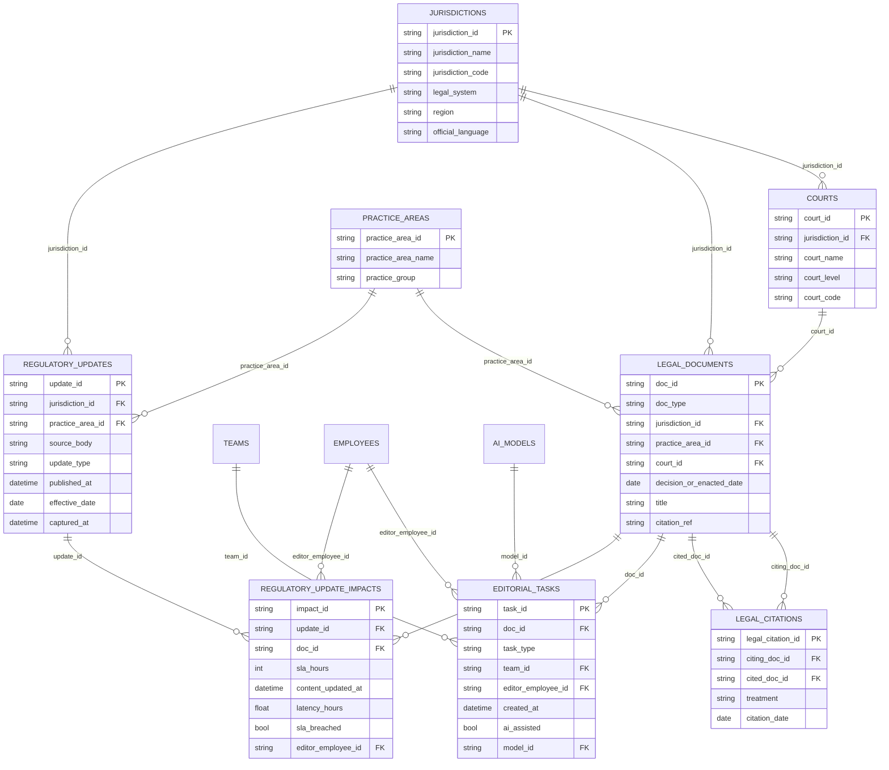

## D. Risk & Business Analytics Operations

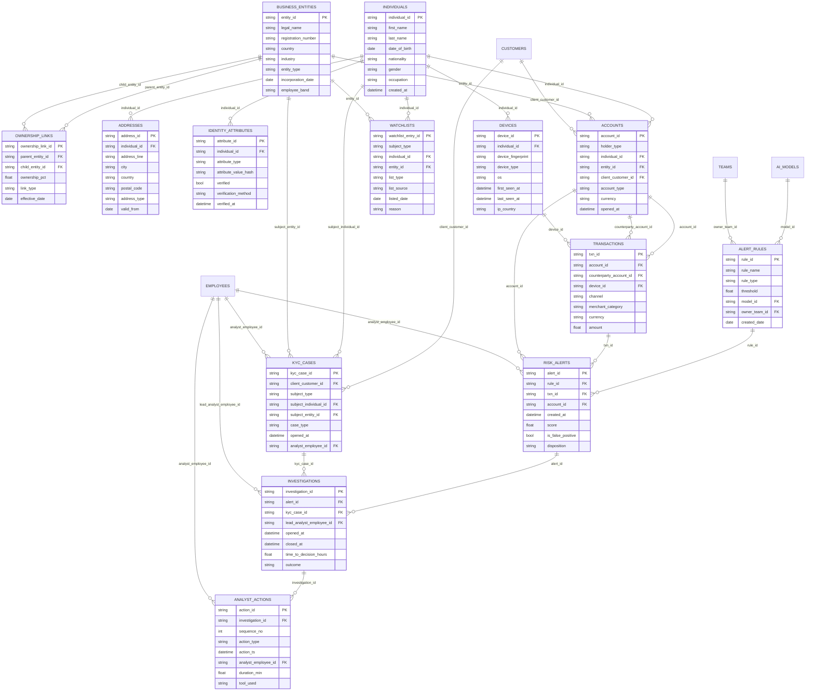

## E. Exhibitions & Events

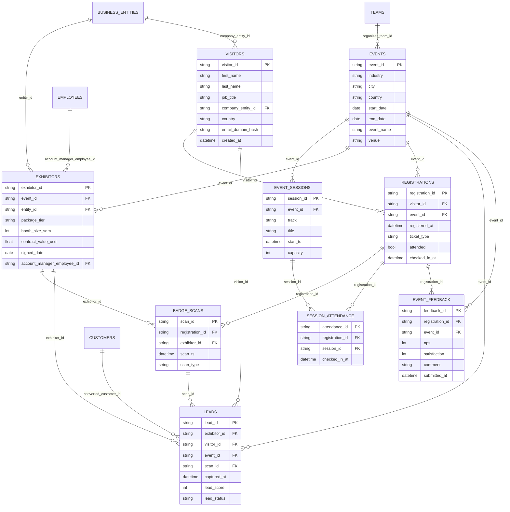

## F. Customer Service & Support

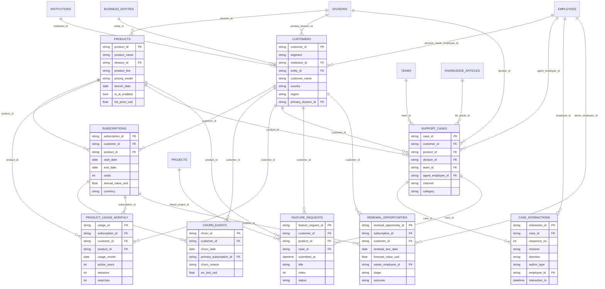

## G. Finance Shared Services

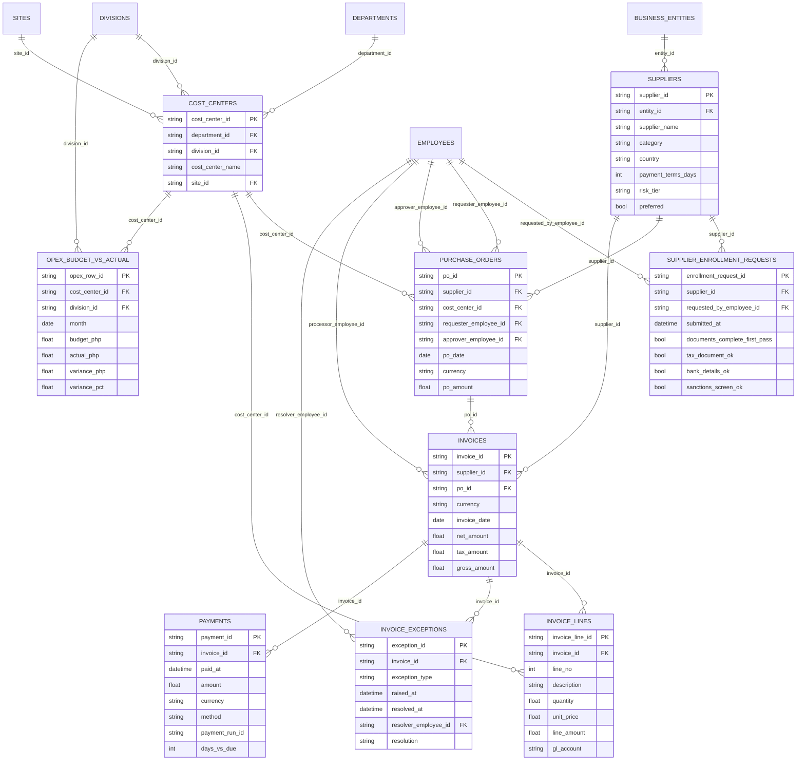

## H. Technology & IT Operations

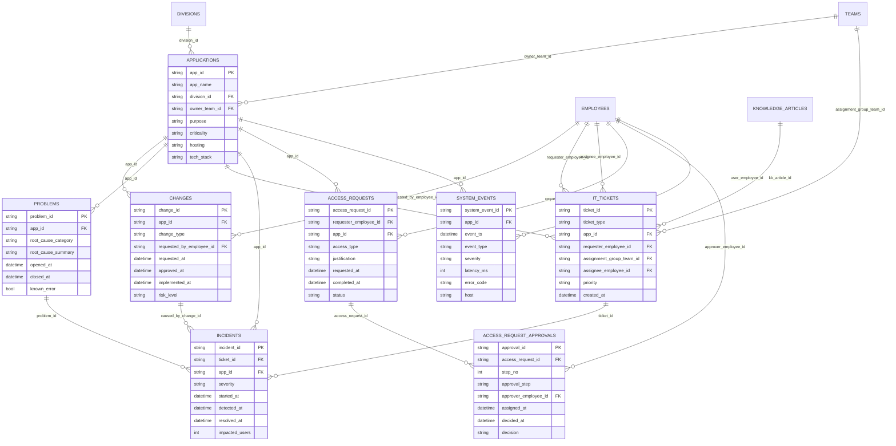

## I. Process Intelligence (Process Mining)

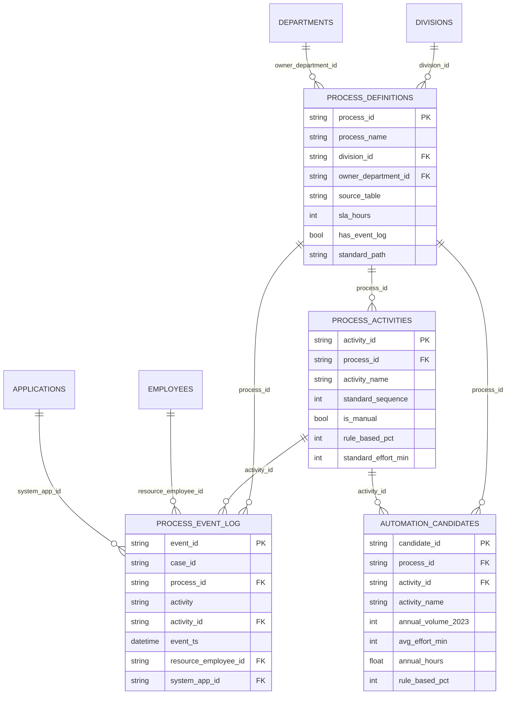

## J. AI, Automation & Transformation Portfolio

```mermaid
erDiagram
    AI_MODELS {
        string model_id PK
        string model_type
        string model_name
        string provider
        string hosting
        string owner_team_id FK
        string risk_classification
        date created_date
    }
    TEAMS ||--o{ AI_MODELS : "owner_team_id"
    MODEL_VERSIONS {
        string model_version_id PK
        string model_id FK
        string version
        date released_date
        float eval_accuracy
        float eval_hallucination_rate
        string status
    }
    AI_MODELS ||--o{ MODEL_VERSIONS : "model_id"
    AI_USE_CASES {
        string use_case_id PK
        string use_case_name
        string division_id FK
        string process_id FK
        string archetype
        string stage
        string primary_kpi
        string owner_team_id FK
    }
    DIVISIONS ||--o{ AI_USE_CASES : "division_id"
    PROCESS_DEFINITIONS ||--o{ AI_USE_CASES : "process_id"
    TEAMS ||--o{ AI_USE_CASES : "owner_team_id"
    EMPLOYEES ||--o{ AI_USE_CASES : "sponsor_employee_id"
    EMPLOYEES ||--o{ AI_USE_CASES : "product_owner_employee_id"
    AI_MODELS ||--o{ AI_USE_CASES : "model_id"
    AI_USE_CASE_KPIS {
        string kpi_id PK
        string use_case_id FK
        string kpi_name
        float baseline_value
        float current_value
        date measured_date
    }
    AI_USE_CASES ||--o{ AI_USE_CASE_KPIS : "use_case_id"
    AI_GOVERNANCE_REVIEWS {
        string review_id PK
        string use_case_id FK
        string review_type
        string reviewer_employee_id FK
        datetime submitted_at
        datetime completed_at
        string status
        int findings_count
    }
    AI_USE_CASES ||--o{ AI_GOVERNANCE_REVIEWS : "use_case_id"
    EMPLOYEES ||--o{ AI_GOVERNANCE_REVIEWS : "reviewer_employee_id"
    PROJECTS {
        string project_id PK
        string project_type
        string use_case_id FK
        string owner_team_id FK
        string division_id FK
        string pm_employee_id FK
        string project_name
        date start_date
    }
    AI_USE_CASES ||--o{ PROJECTS : "use_case_id"
    TEAMS ||--o{ PROJECTS : "owner_team_id"
    DIVISIONS ||--o{ PROJECTS : "division_id"
    EMPLOYEES ||--o{ PROJECTS : "pm_employee_id"
    PROJECT_MEMBERS {
        string project_member_id PK
        string project_id FK
        string employee_id FK
        string project_role
        int allocation_pct
    }
    PROJECTS ||--o{ PROJECT_MEMBERS : "project_id"
    EMPLOYEES ||--o{ PROJECT_MEMBERS : "employee_id"
    PROJECT_TASKS {
        string task_id PK
        string project_id FK
        string assignee_employee_id FK
        string title
        datetime created_at
        date due_date
        float estimate_hours
        datetime completed_at
    }
    PROJECTS ||--o{ PROJECT_TASKS : "project_id"
    EMPLOYEES ||--o{ PROJECT_TASKS : "assignee_employee_id"
    MILESTONES {
        string milestone_id PK
        string project_id FK
        string milestone_name
        date planned_date
        date actual_date
        string status
    }
    PROJECTS ||--o{ MILESTONES : "project_id"
    PROJECT_RISKS {
        string risk_id PK
        string project_id FK
        string category
        string description
        int likelihood
        int impact
        string status
        string owner_employee_id FK
    }
    PROJECTS ||--o{ PROJECT_RISKS : "project_id"
    EMPLOYEES ||--o{ PROJECT_RISKS : "owner_employee_id"
    INNOVATION_IDEAS {
        string idea_id PK
        string submitted_by_employee_id FK
        string team_id FK
        string title
        string description
        datetime submitted_at
        int votes
        string status
    }
    EMPLOYEES ||--o{ INNOVATION_IDEAS : "submitted_by_employee_id"
    TEAMS ||--o{ INNOVATION_IDEAS : "team_id"
    AI_USE_CASES ||--o{ INNOVATION_IDEAS : "linked_use_case_id"
    AI_USAGE_EVENTS {
        string usage_event_id PK
        string employee_id FK
        string tool
        datetime event_ts
        string use_case_id FK
        string model_id FK
        string task_type
        int prompt_tokens
    }
    EMPLOYEES ||--o{ AI_USAGE_EVENTS : "employee_id"
    AI_USE_CASES ||--o{ AI_USAGE_EVENTS : "use_case_id"
    AI_MODELS ||--o{ AI_USAGE_EVENTS : "model_id"
    PROMPTS_LIBRARY {
        string prompt_id PK
        string author_employee_id FK
        string task_type
        string use_case_id FK
        string title
        string prompt_text
        datetime created_at
        float rating_avg
    }
    EMPLOYEES ||--o{ PROMPTS_LIBRARY : "author_employee_id"
    AI_USE_CASES ||--o{ PROMPTS_LIBRARY : "use_case_id"
    AI_FEEDBACK {
        string ai_feedback_id PK
        string usage_event_id FK
        string employee_id FK
        int rating
        string feedback_type
        string comment
        datetime submitted_at
    }
    AI_USAGE_EVENTS ||--o{ AI_FEEDBACK : "usage_event_id"
    EMPLOYEES ||--o{ AI_FEEDBACK : "employee_id"
```

## K. Knowledge & Collaboration (Unstructured)

```mermaid
erDiagram
    KNOWLEDGE_ARTICLES {
        string article_id PK
        string article_type
        string topic_key
        string division_id FK
        string product_id FK
        string app_id FK
        string title
        string owner_team_id FK
    }
    DIVISIONS ||--o{ KNOWLEDGE_ARTICLES : "division_id"
    PRODUCTS ||--o{ KNOWLEDGE_ARTICLES : "product_id"
    APPLICATIONS ||--o{ KNOWLEDGE_ARTICLES : "app_id"
    TEAMS ||--o{ KNOWLEDGE_ARTICLES : "owner_team_id"
    EMPLOYEES ||--o{ KNOWLEDGE_ARTICLES : "author_employee_id"
    KNOWLEDGE_ARTICLE_VERSIONS {
        string article_version_id PK
        string article_id FK
        int version_no
        datetime edited_at
        string edited_by_employee_id FK
        string change_summary
    }
    KNOWLEDGE_ARTICLES ||--o{ KNOWLEDGE_ARTICLE_VERSIONS : "article_id"
    EMPLOYEES ||--o{ KNOWLEDGE_ARTICLE_VERSIONS : "edited_by_employee_id"
    SOPS {
        string sop_id PK
        string article_id FK
        string process_id FK
        string sop_title
        int version
        date effective_date
        date review_due_date
        bool is_current
    }
    KNOWLEDGE_ARTICLES ||--o{ SOPS : "article_id"
    PROCESS_DEFINITIONS ||--o{ SOPS : "process_id"
    EMPLOYEES ||--o{ SOPS : "owner_employee_id"
    DOCUMENTS {
        string document_id PK
        string project_id FK
        string doc_type
        string author_employee_id FK
        datetime created_at
        string title
        string body
    }
    PROJECTS ||--o{ DOCUMENTS : "project_id"
    EMPLOYEES ||--o{ DOCUMENTS : "author_employee_id"
    MEETINGS {
        string meeting_id PK
        string project_id FK
        string team_id FK
        string organizer_employee_id FK
        string meeting_type
        string title
        datetime start_ts
        int duration_min
    }
    PROJECTS ||--o{ MEETINGS : "project_id"
    TEAMS ||--o{ MEETINGS : "team_id"
    EMPLOYEES ||--o{ MEETINGS : "organizer_employee_id"
    ACTION_ITEMS {
        string action_item_id PK
        string meeting_id FK
        string owner_employee_id FK
        string description
        date due_date
        datetime completed_at
        string status
    }
    MEETINGS ||--o{ ACTION_ITEMS : "meeting_id"
    EMPLOYEES ||--o{ ACTION_ITEMS : "owner_employee_id"
    CHAT_CHANNELS {
        string channel_id PK
        string team_id FK
        string project_id FK
        string channel_name
        datetime created_at
    }
    TEAMS ||--o{ CHAT_CHANNELS : "team_id"
    PROJECTS ||--o{ CHAT_CHANNELS : "project_id"
    CHAT_MESSAGES {
        string message_id PK
        string channel_id FK
        string sender_employee_id FK
        datetime sent_at
        string message_text
        bool is_taglish
        string reply_to_message_id FK
        int mentions_count
    }
    CHAT_CHANNELS ||--o{ CHAT_MESSAGES : "channel_id"
    EMPLOYEES ||--o{ CHAT_MESSAGES : "sender_employee_id"
    CHAT_MESSAGES ||--o{ CHAT_MESSAGES : "reply_to_message_id"
    EMAILS {
        string email_id PK
        string sender_employee_id FK
        string recipient_employee_id FK
        int cc_count
        datetime sent_at
        string subject
        string body
        string related_case_id FK
    }
    EMPLOYEES ||--o{ EMAILS : "sender_employee_id"
    EMPLOYEES ||--o{ EMAILS : "recipient_employee_id"
    SUPPORT_CASES ||--o{ EMAILS : "related_case_id"
    SEARCH_LOGS {
        string search_id PK
        string employee_id FK
        datetime searched_at
        string query_text
        int results_count
        string clicked_article_id FK
        string source
    }
    EMPLOYEES ||--o{ SEARCH_LOGS : "employee_id"
    KNOWLEDGE_ARTICLES ||--o{ SEARCH_LOGS : "clicked_article_id"
```
